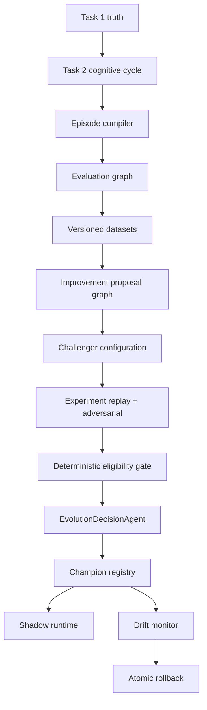

# Task 3 — Agent-Sovereign Evaluation, Learning, and Cognitive Evolution

Task 3 adds a paper-only cognitive evolution loop on top of the approved Task 1 truth layer and Task 2 cognitive graph. Runtime agents never edit repository source, safety validators, broker adapters, or CI configuration.

## Authority boundaries

| Owner | Responsibilities |
| --- | --- |
| Agents | Weakness hypotheses, permitted cognitive patches, strategic promote/reject/extend-shadow/request-more-evidence, strategic rollback review |
| Deterministic infrastructure | Episode integrity, datasets/leakage controls, replay isolation, statistics, safety/integrity vetoes, champion CAS, rollback mechanics, idempotency, audit |
| Humans | Task 1/broker/gateway/safety/live-money/migrations/credentials/source patches |

## Closed loop

## Episode lifecycle

Episodes are compiled only from Task 1 snapshots/DQ/surfaces/ledger projections and Task 2 artefact/model-call/cycle registries. Incomplete episodes are persisted with findings and excluded from promotion statistics by default.

## No chain-of-thought policy

`assert_no_chain_of_thought` rejects hidden reasoning keys in every persisted Task 3 payload. DecisionTraceSummary stores typed conclusions, evidence IDs, confidences, and rejection codes only.

## Challenger / shadow isolation

Shadow challengers receive the same snapshots but cannot access `ExecutionRuntime` or broker submission. Hypothetical commands are persisted separately.

## Promotion and rollback

`PromotionEligibilityGate` computes hard vetoes and non-inferiority checks. Agents cannot promote when eligibility is false. Champion transitions use SQLite `BEGIN IMMEDIATE` compare-and-swap. Safety violations trigger immediate deterministic rollback; strategic degradation requires agent review when configured.

## Worker priority

1. Task 1 ingestion / reconciliation  
2. Urgent position / working-order management  
3. Champion entry decisions  
4. Episode compilation / evaluation / experiments / shadow / drift  

Task 3 may pause under backpressure; it must never drop Task 1 events or delay EXIT.

## Paper-only limitation

`evolution.enabled` defaults to `false`. No CLI command enables live-money trading. Experiment runners never call live `ExecutionRuntime`.
